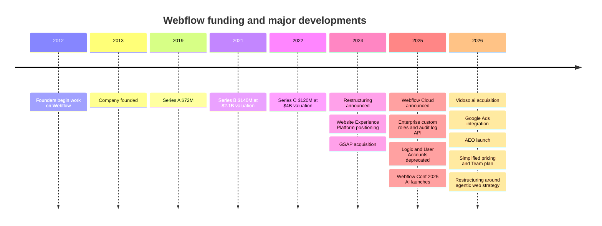
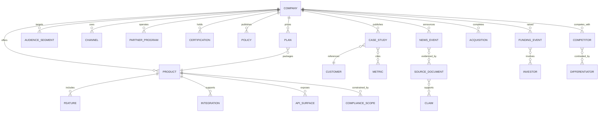

# Webflow Company Profile

## Executive summary

Webflow is a privately held U.S. software company that provides a visual website platform combining site design, CMS, hosting, collaboration, optimization, and an expanding set of AI and extensibility features. Official materials identify the company as **Webflow, Inc.**, a **Delaware corporation** headquartered at **398 11th Street, Floor 2, San Francisco, CA 94103**. Webflow’s official “About” page lists **2013** as its founding year, **900+ team members in 25 countries**, **3.5M users**, and **$335M in total funding**. Its public positioning has evolved from “visual development platform” to “Website Experience Platform,” and now to an “agentic web marketing platform” aimed at helping teams build, manage, and optimize web experiences that drive business outcomes. citeturn5view0turn38view2turn18search4turn31view7turn7view0turn35view0

The current product direction is clear. Webflow is moving upmarket toward marketing teams, creative teams, engineers, agencies, and enterprise buyers that treat the website as a growth engine rather than a lightweight brochure site. That direction is explicit in its solutions navigation, enterprise messaging, and CEO communications. In May 2026, CEO Linda Tong wrote that Webflow is building an “agentic web marketing platform” for teams that need to “ship fast, personalize, experiment, and connect everything to the systems they already run on,” while also acknowledging that simpler AI builders are compressing the low-end of the market. citeturn12search1turn12search11turn12search12turn12search3turn35view0

Commercially, Webflow runs a hybrid self-serve and enterprise model. Public pricing now spans free and paid Site plans, Workspace plans for teams and agencies, add-on products such as Analyze, Optimize, and Localization, and custom-priced Enterprise. In May 2026, Webflow simplified core site pricing, added a new Team plan for growing organizations, and introduced AI credits across Workspace plans. citeturn9view0turn9view1turn9view2turn9view4turn9view5turn31view2turn26search1

From a technology and architecture standpoint, Webflow’s platform now spans managed hosting, a hybrid CMS, APIs, webhooks, OAuth-based apps, a marketplace with 300+ apps, and a newer developer surface called Webflow Cloud for full-stack web applications. Official docs describe managed hosting delivered via Cloudflare, with 99.99% uptime, global CDN support, SSL/TLS, CMS APIs, webhooks, OAuth, and MACH-certified APIs. Webflow Cloud is positioned as a way to deploy full-stack apps alongside Webflow-managed sites, initially with JavaScript and React ecosystem support including Next.js and Astro. citeturn6view0turn18search1turn16view3turn16view1turn16view2turn31view7turn17search8

Financial transparency is limited because Webflow is private. The strongest official signal is the company’s own statement of **$335M total funding**. Secondary reporting fills in the funding timeline: Series A of **$72M** in 2019, Series B of **$140M** in 2021 at a **$2.1B valuation**, and Series C of **$120M** in 2022 at a **$4B valuation**. Revenue is not publicly reported; Forbes wrote in 2022 that Webflow was nearing **$100M ARR**, while Sacra later estimated roughly **$200M ARR in 2023**. Those revenue figures should be treated as secondary estimates, not company-confirmed reporting. citeturn38view2turn25search9turn25search6turn24search7turn24search2turn22search2turn22search6

For an internal knowledge graph, the most useful framing is to model Webflow as a company node connected to product, pricing, audience, partner, compliance, customer-story, acquisition, release, certification, and competitive-set nodes. That structure will support GTM, partnership, product-marketing, sales-enablement, and competitive-intelligence use cases with relatively low schema complexity.

## Company description

### Core company profile

| Attribute | Current finding | Evidence |
|---|---|---|
| Legal entity | Webflow, Inc. | citeturn5view0 |
| Jurisdiction | Delaware corporation | citeturn5view0 |
| Headquarters | 398 11th Street, Floor 2, San Francisco, CA 94103 | citeturn5view0turn5view1 |
| Founded | 2013 | citeturn38view2 |
| Founders | Bryant Chou, Sergie Magdalin, Vlad Magdalin | citeturn11search1turn38view3 |
| Current CEO | Linda Tong | citeturn38view3turn35view0 |
| Team size | 900+ team members in 25 countries | citeturn38view2 |
| User base | 3.5M users | citeturn38view2 |
| Funding disclosed by company | $335M total funding | citeturn38view2 |
| Current positioning | “agentic web marketing platform” / “Website Experience Platform” | citeturn7view0turn31view7turn35view0 |

Webflow’s public history can be read in two layers. Officially, the company lists **2013** as its founding year. In a founder-written history post, Vlad Magdalin says the founders started working on Webflow in **September 2012**, built an early prototype by March 2013, and entered Y Combinator after an initial rejection. The company’s Y Combinator profile also lists Webflow as **S13**. citeturn38view2turn11search0turn25search0turn25search3

Webflow’s long-running mission language has centered on democratizing development. Linda Tong wrote in 2024 that Webflow’s mission is “delivering development superpowers to everyone,” and in the 2024 GSAP acquisition announcement she wrote that Webflow’s mission has been “to bring development superpowers to everyone from freelancers, to agencies, and marketing teams of all sizes.” By 2025 and 2026, the public vision sharpened into a broader website operating system: first a **Website Experience Platform**, then an **agentic web marketing platform** built for teams that need to connect sites, optimization, experimentation, and marketing systems. citeturn33search1turn36search3turn31view7turn35view0turn7view0

### Core products

Webflow’s product suite now spans design/build, content/CMS, hosting, collaboration, AI, localization, analytics, optimization, apps, and full-stack app hosting. The homepage, pricing, and product navigation enumerate the core surfaces as Design, Edit content, Interactions, Page building, Shared Libraries, Collaboration, CMS, Hosting, Localization, Security, Ecommerce, Analyze, Optimize, SEO, AEO, Webflow Cloud, DevLink, Figma to Webflow, Accessibility, and AI. citeturn6view0turn4view1turn38view3

Webflow’s public product narrative is especially strong on three jobs to be done. First, **build together** through shared workspaces and design systems. Second, **publish at scale** through a visual, composable CMS with SEO and AEO. Third, **optimize for growth** with native analytics, experimentation, and AI support. That framing is consistent across the homepage, enterprise pages, and the 2025 to 2026 launch narrative. citeturn7view0turn12search1turn31view0turn36search7

### Pricing tiers

The pricing architecture now has four layers: Site plans, Workspace plans for teams, Workspace plans for freelancers and agencies, and paid add-ons such as Analyze, Optimize, and Localization. The table below captures the current public tiers reviewed during this research. citeturn9view0turn9view4turn9view5turn10view1turn26search1

| Pricing family | Tier | Public price | Positioning | Selected included capabilities | Evidence |
|---|---|---:|---|---|---|
| Site plans | Starter | Free | Explore and experiment | webflow.io domain, limited CMS, 2 static pages, 1 GB bandwidth, 50 form submissions | citeturn9view0 |
| Site plans | Basic | $15/mo billed yearly | Simple sites without CMS | Custom domain, 300 static pages, 10 GB bandwidth, unlimited form submissions | citeturn9view1 |
| Site plans | Premium | $25/mo billed yearly | Content-rich, traffic-heavy sites | CMS, scalable bandwidth options, code components, site search, file upload | citeturn9view2turn31view2 |
| Platform plans | Team | $2,500/mo annual contract | Growing teams between self-serve and enterprise | Site and workspace, Localization, AEO agents, publishing workflows, single-page publishing, activity log and API | citeturn9view2turn31view2 |
| Platform plans | Enterprise | Custom | Flexible, scalable large-org plan | Granular permissions, custom roles, advanced governance, secure integrations, dedicated account manager, enhanced SLAs | citeturn9view0turn8view1 |
| Workspace plans for teams | Starter | Free | Default account workspace | 2 staging sites, 1 full seat, 200 AI credits | citeturn9view4 |
| Workspace plans for teams | Growth | $49/mo billed yearly | Unlimited staging and advanced collaboration | Unlimited staging sites, 400 AI credits, site-level roles, publishing permissions | citeturn10view1 |
| Workspace plans for freelancers/agencies | Freelancer | $16/mo billed yearly | Small client roster | 10 staging sites, shared libraries, client payments | citeturn9view5 |
| Workspace plans for freelancers/agencies | Agency | $35/mo billed yearly | Large client roster | Unlimited staging sites, 3 free client seats per site, unlimited shared libraries, site-level roles | citeturn9view5turn9view6 |
| Add-on | Analyze | Starting at $9/mo | Site analytics | Page views, sessions, visitors, click data, page insights | citeturn26search1 |
| Add-on | Optimize | Starting at $299/mo | Conversion optimization | A/B testing, personalization, AI Optimize, audience targeting | citeturn26search1 |
| Add-on | Localization Essential | Starting at $9/mo | Intro localization | Machine translation, CMS and static page localization, localized SEO | citeturn26search1 |
| Add-on | Localization Advanced | Starting at $29/mo | Expanded localization | Asset localization, localized URLs, automatic visitor routing | citeturn26search1 |

### Mission, vision, and what is unspecified

A concise, permanently pinned one-line mission statement is **not** prominent on the current About page. The strongest mission wording in reviewed primary sources is “delivering development superpowers to everyone,” while the strongest current vision wording is that Webflow is building an “agentic web marketing platform” for teams whose websites are growth engines. A separate public vision statement beyond that language was not clearly specified in reviewed materials. citeturn33search1turn36search3turn35view0

## Audiences and channels

### Audience segmentation

Webflow explicitly segments its market around **marketers, designers, developers, agencies, freelancers, startups, and enterprise teams**. The site navigation and solution pages further break marketers into brand, performance, digital experience, and technical marketing roles, while engineering is split into engineering leaders and developers. Enterprise positioning is tailored separately for marketing, design, engineering, and agencies. citeturn4view1turn12search1turn12search2turn12search5turn12search11turn12search12turn12search16

| Audience segment | Webflow’s stated pain point | Product fit / value proposition | Evidence |
|---|---|---|---|
| Marketers | Slow website changes, engineering dependency, fragmented data and stack | Visual publishing, CMS, Analyze, Optimize, AEO, integrations, experimentation | citeturn7view0turn12search2turn12search5turn12search8 |
| Designers / creative teams | Pixel-perfect control, brand consistency, handoff friction | Visual-first design system, components, shared libraries, Figma and React adjacencies | citeturn7view0turn12search16turn6view0 |
| Developers / engineering leaders | Ticket overload, CMS maintenance, need for clean output and extensibility | Semantic HTML/CSS/JS output, APIs, webhooks, OAuth, Webflow Cloud, custom code | citeturn7view0turn12search11turn12search12turn16view1turn16view2turn31view7 |
| Agencies / freelancers | Faster delivery, client handoff, recurring revenue, multi-client collaboration | Agency workspaces, client access, marketplace visibility, optimization upsell | citeturn7view0turn12search3turn12search9turn9view4turn9view5 |
| Startups | Fast launch without rebuilds, growth-ready marketing site | Startup program, discounts, partner ecosystem, AI-native platform | citeturn12search0turn12search6turn12search17 |
| Enterprise | Governance, security, scale, support, success services | Custom roles, audit log API, SSO, SCIM, SLAs, account management, support | citeturn12search1turn20search0turn31view3turn12search7turn12search13 |

Webflow’s buyer-center is now clearly **marketing-led**, but not marketing-only. The strongest enterprise wedge is the promise that marketers gain speed and autonomy while engineering retains guardrails and integration control. That same pattern appears in the homepage schema, enterprise messaging, engineering pages, and CEO strategy memo. citeturn7view0turn12search1turn12search11turn35view0

Education and nonprofit targeting are **not prominently specified** in the current solution architecture reviewed here. I did not identify a dedicated education or nonprofit segment page in the primary materials reviewed, so the safest graph value is **“unspecified in reviewed public sources.”**

### Channels, sales motion, ecosystem, and support

Webflow’s channel mix is heavily weighted toward owned media, product-led discovery, education, community, and ecosystem leverage. Public channels include the main site, blog, webinars and ebooks, Webflow University, the developer docs site, marketplace, customer stories, community forum, local chapters/network groups, templates, Made in Webflow, social profiles, and events such as Webflow Conf. The homepage and footer make these routes explicit. citeturn6view0turn13search2turn13search3turn13search1turn13search4turn13search13turn21search6

The sales motion is mixed PLG plus enterprise sales. Self-serve entry points are “Start for free” and transparent pricing. The enterprise motion includes “Talk to sales,” custom pricing, guided onboarding, a dedicated success structure, and premium support. Enterprise pages also emphasize customer success managers, solutions architects, strategic consulting, and tailored support. citeturn6view0turn9view0turn12search7turn12search13turn10view5

The partner ecosystem includes certified partners, agencies, freelancers, global alliance partners, affiliates, template designers, app developers, and startup ecosystem partners such as accelerators and investors. Marketplace inventory now spans apps, libraries, templates, Made in Webflow showcases, and certified partners. Webflow reported **300+ apps** in the Marketplace in April 2025. citeturn12search9turn12search18turn13search12turn13search9turn38view4

Support is multi-layered: Help Center, Support Portal, Status page, community Q&A, university training, and enterprise success resources. For day-to-day users, Support and Community are the main public routes. For enterprise, support expands to priority queues, onboarding, Webflow University Pro, success managers, and optional premium SLA features. citeturn13search7turn13search8turn38view4turn10view5turn20search0

## Goals, financials, funding, and recent news

### Stated strategic goals and public roadmap

Publicly, Webflow’s strategy is not subtle. The company is trying to become the default operating system for revenue-driving web experiences. Its key strategic themes are: move from “website builder” to **Website Experience Platform**, then to **agentic web marketing platform**; deepen support for optimization and AI search with Analyze, Optimize, and AEO; serve larger teams that need governance and extensibility; and expand the developer surface with Webflow Cloud and AI code generation. citeturn31view7turn31view4turn31view0turn36search7turn35view0

Public numeric company goals and growth targets are limited. The clearest public scale markers are **3.5M users**, **300,000+ brands/teams**, and **900+ employees in 25 countries**. I did **not** find formal public forward-looking revenue targets or board-level KPI targets in the reviewed official materials. citeturn38view2turn7view0turn13search20

The public roadmap is more visible than financial guidance. Across 2025 to 2026 product announcements, Webflow highlighted AI assistant expansion, AI-powered app generation, code generation, AEO agents, AI traffic and goal reporting, Webflow Cloud, Team plan packaging, API v2 token migration, Cloudflare infrastructure migration, enterprise custom roles and audit log API, and an ecosystem-first deprecation of Logic and User Accounts. citeturn31view0turn31view3turn31view4turn31view5turn31view2turn31view1turn36search7turn28search18

### Funding and financial profile

| Date | Event | Amount / valuation | Notes | Evidence |
|---|---|---:|---|---|
| 2013 | Y Combinator S13 | Unspecified | Official YC company profile lists Webflow in batch S13 | citeturn25search0turn25search3 |
| Aug 2019 | Series A | $72M | Official company blog announced the round; Crunchbase News associated valuation with roughly $350M to $400M post-money | citeturn25search9turn24search0 |
| Jan 2021 | Series B | $140M at $2.1B valuation | Official company announcement plus TechCrunch coverage | citeturn25search6turn24search7 |
| Mar 2022 | Series C | $120M at $4B valuation | Forbes reported the round and valuation | citeturn24search2turn22search2 |
| Current official disclosure | Total funding | $335M | Company “About” page | citeturn38view2 |

Webflow does not publicly publish audited financial statements in the materials reviewed here, and I did not identify a public investor-relations or SEC-reporting site. The company should therefore be modeled as **private**, with high confidence on funding history but lower confidence on current revenue. Forbes reported in 2022 that Webflow was nearing **$100M ARR**, and Sacra later estimated roughly **$200M ARR in 2023**. Those numbers are useful directional signals for internal modeling, but they are not company-confirmed public revenue disclosures. citeturn24search2turn22search2turn22search6

### Recent news and material developments



| Date | Development | Why it matters | Evidence |
|---|---|---|---|
| Jul 2024 | Webflow announced restructuring affecting approximately 8% of staff | Signaled strategic refocus and operating reset | citeturn21search0turn33search1 |
| Oct 2024 | Webflow announced it was “the first Website Experience Platform” | Repositioned brand beyond no-code site builder | citeturn31view7turn31view4 |
| Oct 2024 | Webflow acquired GSAP / GreenSock business | Strengthened animation and developer/design differentiation | citeturn36search3turn32search1turn32search4 |
| Dec 2024 | Logic and User Accounts deprecated in favor of ecosystem-first partners | Important platform-scope contraction and ecosystem signal | citeturn31view4 |
| Jan 2025 | Enterprise Winter Release introduced custom roles and audit log API | Strengthened enterprise governance and compliance posture | citeturn31view3turn20search0 |
| May 2025 | Webflow Cloud launched in private beta | Expanded platform into full-stack app hosting | citeturn31view7turn32search13turn32search9 |
| Sep 2025 | Webflow Conf 2025 unveiled AI assistant upgrades, AI code generation, and broader workflow automation | Accelerated AI-native product strategy | citeturn31view0 |
| Mar 2026 | Webflow acquired Vidoso.ai | Extended AI content asset generation for marketing teams | citeturn36search0 |
| May 2026 | Webflow launched AEO and a simplified pricing model including Team plan and AI credits | Reinforced AI-search and growth-optimization thesis | citeturn36search7turn31view2 |
| May 2026 | CEO announced a new restructuring tied to the “agentic web” strategy | Confirms upmarket strategy and smaller, AI-enabled teams | citeturn35view0turn22news34 |

## Technology, compliance, and competitive landscape

### Technology and architecture

Webflow describes itself as a managed platform rather than a toolkit customers assemble. Official hosting documentation says Webflow hosting is “completely managed,” built to handle millions of page views per day with sub-100ms response times, and that Webflow sites are securely stored and delivered by **Cloudflare**. The homepage also advertises **99.99% uptime**, a **global CDN**, and **edge routing**. citeturn18search1turn6view0

The CMS is best described as **hybrid**. Webflow’s CMS feature page says it combines visual site-builder speed with headless CMS extensibility and the native toolkit of digital experience platforms. Official copy highlights both visual content management and “MACH-certified headless APIs.” In practice, that means marketers can edit in context while developers can also use APIs to programmatically manage and distribute content. citeturn15search6turn16view3

Developer extensibility is mature and widening. Official docs cover CMS CRUD APIs, webhooks for event-driven automation, OAuth 2.0 authorization for apps, scope-based permissions, custom code, and marketplace app submission. Webflow also supports app installations from the marketplace or the in-product Apps panel, and the marketplace had passed **300 apps** by April 2025. citeturn14search3turn16view1turn16view2turn14search2turn13search6turn13search9turn14search5

Webflow Cloud is the clearest architectural expansion beyond classic site building. Webflow says it uses native hosting infrastructure powered by Cloudflare to let developers deploy full-stack applications and dynamic web experiences alongside sites. In launch materials, that beta supported the JavaScript and React ecosystem including **Next.js** and **Astro**, and later technical content stated that Webflow Cloud runs on **Cloudflare Workers**. citeturn31view7turn17search8

A useful internal summary of platform architecture is below.

| Layer | What Webflow offers | Evidence |
|---|---|---|
| Visual build layer | Design, page building, interactions, collaboration, shared libraries | citeturn6view0turn38view3 |
| Content layer | Visual CMS plus API-driven content operations | citeturn16view3turn14search3 |
| Optimization layer | Analyze, Optimize, AEO, SEO | citeturn6view0turn26search1turn36search7 |
| Hosting layer | Fully managed hosting, Cloudflare delivery, SSL/TLS, global CDN, edge routing | citeturn18search1turn6view0turn31view1 |
| Extensibility | Apps marketplace, OAuth, webhooks, custom code, APIs | citeturn16view1turn16view2turn13search12turn14search5 |
| Full-stack app layer | Webflow Cloud for dynamic apps and backend logic | citeturn31view7turn32search9 |

### Legal, privacy, and compliance

Webflow’s privacy and security posture is strong for a private SaaS company, but with an important caveat on residency. Official privacy FAQs state that Webflow stores customer and customer end-user data in the **United States**, where Webflow is based. For European transfers, Webflow says it is certified under the **EU-U.S. Data Privacy Framework**, **Swiss-U.S. DPF**, and **UK Extension**, and that its DPA includes **EU SCCs** and the **UK IDTA**. citeturn19view0turn19view1

On security certifications, Webflow’s Trust Center states that it is independently audited for **SOC 2 Type II** and certified **ISO 27001** compliant. The Trust Center also lists **ISO/IEC 27017:2015** and **PCI DSS** materials. Enterprise security messaging further highlights SSO, SCIM, JIT provisioning, TLS/SSL encryption, DDoS mitigation with AWS and Cloudflare, optional custom SSL certificates, security headers, and an audit log API. citeturn19view2turn19view3turn20search0

One important constraint is healthcare compliance. Webflow’s terms explicitly state that the platform **may not be HIPAA compliant** and customers should not provide Protected Health Information through the platform. That matters for qualification, legal review, and customer segmentation in the knowledge graph. citeturn5view2

| Topic | Public finding | Evidence |
|---|---|---|
| Data storage / residency | Customer and end-user data stored in the U.S. | citeturn19view0 |
| Transfer mechanisms | DPF certification, SCCs, UK IDTA via DPA | citeturn19view1 |
| Security certifications | SOC 2 Type II, ISO 27001; Trust Center also lists ISO 27017 and PCI DSS materials | citeturn19view2turn19view3 |
| Encryption | Data encrypted in transit and at rest | citeturn19view0 |
| Enterprise identity/security | SSO, SCIM, JIT, audit log API, custom security headers, custom SSL certs | citeturn20search0turn31view3 |
| HIPAA | Not suitable for PHI / may not be HIPAA compliant | citeturn5view2 |

### Competitive landscape

Webflow itself foregrounds **Contentful, Framer, Sitecore, Wix, and WordPress** in its comparison architecture. The most useful analytical view is that Webflow is trying to occupy the middle ground between consumer-first site builders and heavyweight enterprise DXPs: more design control and native optimization than low-end builders, but less implementation complexity than legacy digital-experience suites. citeturn6view0turn38view4turn30search1turn30search5turn30search7turn30search8

| Competitor | Competitive archetype | Webflow’s stated wedge | Best-fit interpretation |
|---|---|---|---|
| WordPress | Open-source CMS + plugin ecosystem | Webflow says it offers native capabilities that WordPress often requires plugins for, including CMS flexibility, layout, SEO, and managed hosting | Best when plugin breadth and open-source control matter most; Webflow’s wedge is fewer moving pieces and more native visual control. citeturn30search1turn16view3 |
| Framer | Design-first modern website builder | Webflow says Framer is easier to learn, while Webflow offers deeper web fundamentals, support, and enterprise readiness | Framer likely competes strongest for lighter marketing sites and design-led teams; Webflow aims for broader scale, governance, and extensibility. citeturn30search7turn20search0 |
| Contentful | API-first headless CMS | Webflow positions itself as a visual-first, composable CMS with both marketer usability and headless APIs | Contentful fits API-first content orchestration; Webflow fits teams that want CMS plus design, hosting, and operating velocity in one platform. citeturn30search8turn16view3 |
| Sitecore | Traditional enterprise DXP | Webflow emphasizes faster time to market, lower operational cost, managed hosting, and marketing autonomy | Sitecore fits broader legacy DXP estates; Webflow’s wedge is speed, lower implementation load, and marketer ownership. citeturn30search5turn12search1 |

The most defensible differentiators surfaced in primary sources are these: visual-first design with semantic code output, managed infrastructure, integrated CMS, strong collaboration/governance tooling, growing optimization stack, apps and APIs, and AI-search/AEO positioning. The biggest strategic risk is that AI-native lightweight builders compress the low-end website market faster than Webflow can continue moving upmarket. That risk is explicitly acknowledged by the CEO in the May 2026 restructuring note. citeturn7view0turn16view3turn18search1turn35view0

## Notable customers and proof base

### Customer proof and case studies

Webflow’s public proof strategy is extensive and highly outcome-oriented. The homepage names reference brands such as IDEO, monday.com, BBDO, The New York Times, and TED, while the customer-stories section highlights deeper case studies across software, fitness, fintech, automotive, and enterprise marketing. citeturn4view1turn6view0turn28search5

| Customer | Publicly cited outcome | What it supports | Evidence |
|---|---|---|---|
| Orangetheory Fitness | $6M annual cost savings, 6x faster project delivery, 4x better site performance | Enterprise ROI, speed, scale | citeturn28search1 |
| Fivetran | 98% increase in speed to market, 4x production increase of SEO articles, 130+ new pages in 1 year | Marketing velocity, content operations | citeturn28search2 |
| Retool | 70% increase in demo bookings from tests, 50% increase in testing velocity, 33% more demo MQLs from tests | Optimize / experimentation proof | citeturn28search12 |
| Wave | 3x improvement in site speed, 4% to 21% organic traffic increases on converting pages, 6% increase in paid-campaign conversions | Performance marketing proof | citeturn28search3 |
| IONITY | 64% increase in active users after rebuilding on Webflow Enterprise | Enterprise migration and global scale | citeturn28search5 |

A broad proof layer also appears on the homepage and enterprise request-confirmation pages, where Webflow cites outcomes such as **10x annual cost savings**, **67% decrease in dev ticketing**, and **56% increase in form fills** across various customer stories. Because those homepage tiles do not always identify the customer in the same snippet, they are useful as ecosystem proof but less useful as precise graph facts than standalone customer-story pages. citeturn35view0

### Primary and secondary proof sources

| Source type | High-value source | What it covers |
|---|---|---|
| Primary | About page | Founding year, team size, users, leadership, total funding, press references citeturn38view2turn38view3 |
| Primary | Terms and privacy pages | Legal entity, address, DPA/privacy posture, HIPAA limitation citeturn5view0turn19view0turn5view2 |
| Primary | Pricing | Site, workspace, add-on pricing and packaging citeturn9view0turn9view5turn26search1 |
| Primary | Enterprise pages | Security, identity, support, success services, governance citeturn12search1turn20search0turn12search7turn12search13 |
| Primary | Product/docs/help center | Hosting, CMS, APIs, webhooks, OAuth, apps, Webflow Cloud citeturn18search1turn16view3turn16view1turn16view2turn31view7 |
| Primary | Blog / updates | Strategy, launches, deprecations, acquisitions, restructuring citeturn31view0turn31view4turn36search3turn36search0turn35view0 |
| Secondary | Forbes / TechCrunch / Crunchbase News | Funding rounds, valuation, revenue context citeturn24search2turn24search7turn24search0 |
| Secondary | G2 | User review signal, 4.4 rating | citeturn29search8turn38view3 |
| Secondary | Capterra | User review signal, ~4.5 rating / 265-266 reviews in surfaced pages | citeturn29search1turn29search11 |
| Secondary | Axios / SF Chronicle | GSAP acquisition; 2026 restructuring coverage | citeturn32search1turn22news34 |

## Knowledge graph design

### Suggested nodes and relationships

The schema below is designed for internal GTM, product-marketing, sales-enablement, and corp-dev use. It intentionally separates **facts**, **proof artifacts**, and **interpretive entities** so that you can version claims and avoid overwriting one source with another.



### Recommended metadata fields per node

| Node type | Recommended fields |
|---|---|
| Company | `company_id`, `name`, `legal_name`, `hq_city`, `hq_country`, `incorporation_state`, `founded_year`, `status_private_public`, `ceo`, `founders[]`, `employee_count_public`, `user_count_public`, `positioning_current`, `positioning_prior[]`, `last_verified_at` |
| Product | `product_id`, `name`, `category`, `launch_date`, `status_active_beta_deprecated`, `description`, `primary_persona[]`, `dependencies[]`, `source_confidence` |
| Plan | `plan_id`, `family`, `name`, `billing_basis`, `price_public`, `currency`, `annual_monthly_flag`, `target_segment`, `included_features[]`, `effective_date`, `sunset_date`, `source_confidence` |
| Audience segment | `segment_id`, `name`, `role_type`, `org_size`, `industry`, `pain_points[]`, `priority_score`, `evidence_refs[]` |
| Channel | `channel_id`, `type`, `name`, `url`, `owner_team`, `funnel_stage`, `active_flag` |
| Partner program | `program_id`, `name`, `partner_type`, `benefits[]`, `requirements[]`, `launch_date`, `status` |
| Certification / policy | `doc_id`, `name`, `type`, `jurisdiction`, `effective_date`, `last_updated`, `summary`, `public_url`, `scope_notes` |
| Case study | `case_id`, `customer_name`, `industry`, `segment`, `headline`, `metrics[]`, `quote[]`, `use_cases[]`, `publish_date`, `source_url` |
| Funding event | `event_id`, `round`, `date`, `amount_usd`, `valuation_usd`, `lead_investors[]`, `participating_investors[]`, `source_type_primary_secondary`, `confidence` |
| News event | `event_id`, `date`, `title`, `category`, `summary`, `impact_area`, `company_statement_present`, `source_refs[]` |
| Competitor | `competitor_id`, `name`, `category`, `best_fit`, `webflow_counterposition`, `evidence_refs[]` |
| Source document | `source_id`, `publisher`, `url`, `publication_date`, `source_class_primary_secondary`, `claim_ids[]`, `trust_score`, `last_accessed_at` |
| Claim | `claim_id`, `subject_node`, `predicate`, `object_value`, `unit`, `time_context`, `quote_excerpt_optional`, `confidence`, `source_ids[]`, `superseded_by` |

### Suggested graph traversals and internal queries

These are the highest-value queries I’d implement first.

| Internal team | Example graph query | What it answers |
|---|---|---|
| Sales | `Company -> Audience Segment -> Product -> Case Study -> Metric` | Which Webflow capabilities and proof points are strongest for a given buyer persona? |
| Product marketing | `Competitor -> Differentiator -> Product -> Source Document` | Which differentiation claims are best supported against each named competitor? |
| Partnerships | `Partner Program -> Integration -> Audience Segment -> Case Study` | Which ecosystem motions create proof for agencies, startups, or enterprise marketers? |
| Security / legal | `Company -> Policy/Certification -> Compliance Scope -> Product` | Which product surfaces have what compliance assurances and what exclusions? |
| Corp-dev / strategy | `Acquisition -> Product -> News Event -> Positioning Shift` | How have acquisitions changed the platform and narrative over time? |
| Pricing ops | `Plan -> Product -> Audience Segment -> News Event` | Which packaging/pricing changes were introduced for which segments and why? |
| RevOps | `News Event -> Product -> Audience Segment -> Channel` | Which launches are most relevant to active campaigns, enablement decks, and persona messaging? |
| Executive research | `Funding Event -> Investor -> News Event -> Positioning Current` | How has funding and market narrative tracked with strategic repositioning? |

A few concrete pseudo-queries:

```text
MATCH (c:Company {name:"Webflow"})-[:OFFERS]->(p:Product)-[:INCLUDES]->(f:Feature)
WHERE f.name IN ["Optimize","Analyze","AEO","Localization"]
RETURN p, f, p.launch_date, p.status

MATCH (c:Company {name:"Webflow"})-[:TARGETS]->(a:AudienceSegment)-[:SUPPORTED_BY]->(cs:CaseStudy)
WHERE a.name = "Performance marketers"
RETURN cs.customer_name, cs.metrics, cs.source_url

MATCH (c:Company {name:"Webflow"})-[:COMPETES_WITH]->(x:Competitor)
RETURN x.name, x.category, x.webflow_counterposition

MATCH (c:Company {name:"Webflow"})-[:PUBLISHES]->(pol:Policy)
RETURN pol.name, pol.type, pol.last_updated, pol.scope_notes
```

### Open questions and limitations

Some requested dimensions remain only partially public. I did **not** identify a public investor-relations site, SEC reporting set, or audited financial disclosure package. Public forward growth targets and internal KPI targets are therefore **unspecified** in reviewed sources. Revenue figures beyond company-scale markers are secondary estimates only. Education and nonprofit vertical targeting also appear **unspecified** in the reviewed official navigation and pricing sources. Those should be stored in the graph with explicit nullability rather than inferred defaults. citeturn38view2turn24search2turn22search6

For competitive comparisons, Webflow’s own compare pages are useful for mapping the named competitive set and Webflow’s stated wedge, but they are still vendor-authored materials. If you want a more neutral competitive-intelligence layer in the knowledge graph, the next best addition would be category reports, analyst evaluations, and cross-vendor customer win/loss interviews.
